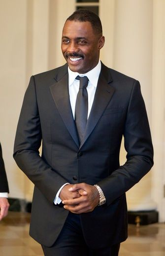

[Home](../index.html "Home")

# Gerrard Malleus

Let the first act of every morning be to make the following resolve for the day:

* I shall not fear anyone on Earth.
* I shall not bear ill will toward anyone.
* I shall not submit to injustice from anyone.
* I shall conquer untruth by truth. And in resisting untruth, I shall put up with all suffering.
  
**Justice**. That is the underpinning of Gerrard Malleus. He has always sought what was just and fair. For the longest time, going back to the days of high school, he always stepped up when the fight was not fair. Born into a middle class family that lived on the wrong side of the tracks, Gerrard faced many fights: race, class, and gangs. With proper training, he would not only take his lumps, but dish them out to those who targeted the vulnerable. This dogged determinism helped him graduate from Mist City's law school magma cum laude. Wanting to protect those who faced pressure from the elite or the gang lords of the southside, Gerrard joined the District Attorney's office. He quickly excelled and became known for winning legal battles where the deck was stacked against him.

Yet there was a duality to Gerrard's life. He manifested his powers when a gang decided to exact vengeance at a particularly brilliant court battle. The gang leader Morpheus was incarcertated on some lesser charge, but it still cleared the streets of a major player. Just as the gang was beating him to an inch of his life, he heard the voice. "Do you vow to walk on the side of law and order? Do you wish to become the embodiment of justice?" In this desperate circumstance, Gerrard readily accepted and he was transformed into[...](marduk.html "Marduk")
