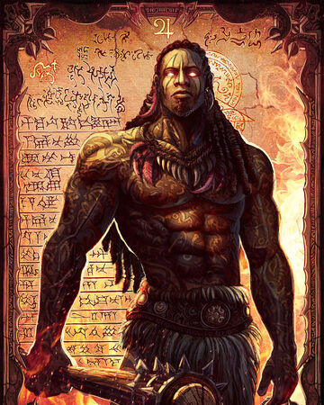

[Home](../index.md "Home")

# Marduk, God of Justic

He felt the surge of the Indominable Will replenish his body. While still bloody and broken, his drive overcame the pain receptors and he threw off his attackers. Raising his hand, he called down The Mace of Shedu, his spiked cudgel, to dispense justice to those who oppose the law. Justice was dispensed quickly. Then raising his hand to his ear, Elemental Whispers gave him signs, portents, and direct clues as to the reason for his attack. It was Morpheus. Evidently, the bars of prison would not contain that particular fiend. However, now Morpheus would need to content with both Gerrard Malleus and Marduk; the fight will be in the courtroom and in the streets.

Ultimately, Marduk looked to find other individuals who could help him combat the reach of Morpheus. He found others; others with powers as remarkable as his own. How can one of the oldest avatars be meshed into "The New Gods"? Simple. Justice never gets old. 